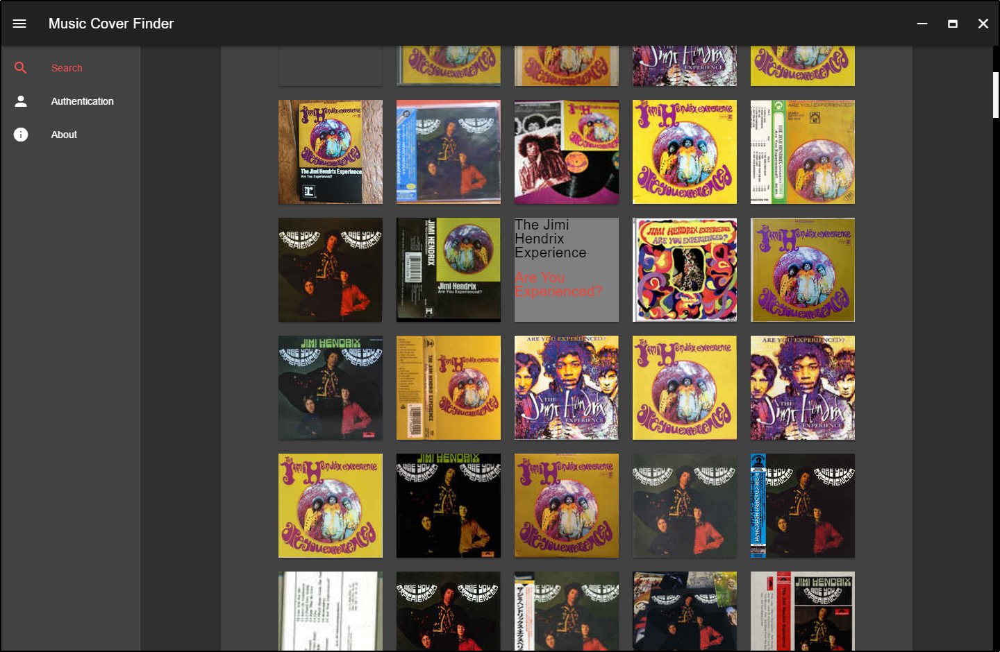
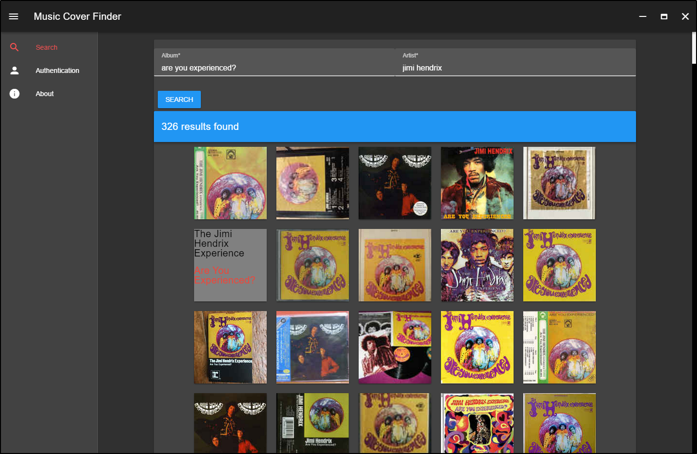
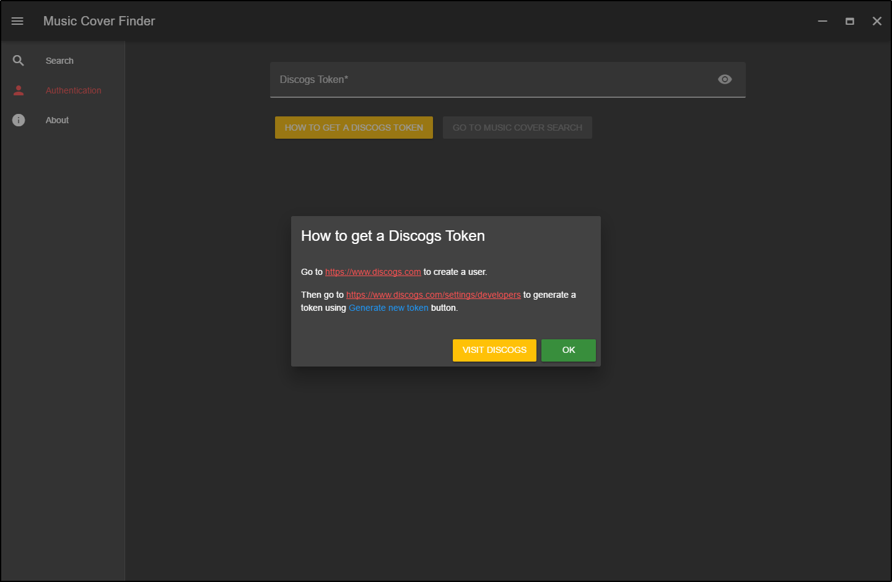
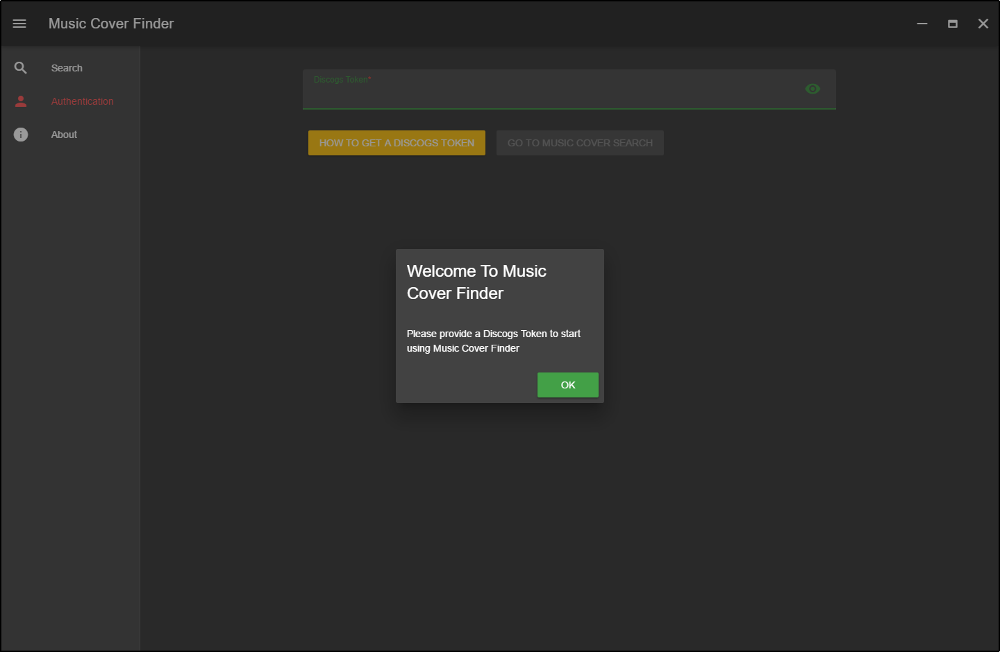

# Music.Cover.Finder

C# desktop demo application that uses [Discogs API](https://www.discogs.com/developers/) to display album art.

Made with [DiscogsClient](https://github.com/David-Desmaisons/DiscogsClient), [Neutronium](https://github.com/NeutroniumCore/Neutronium) and [vuetify](https://vuetifyjs.com/)

## Screenshots

